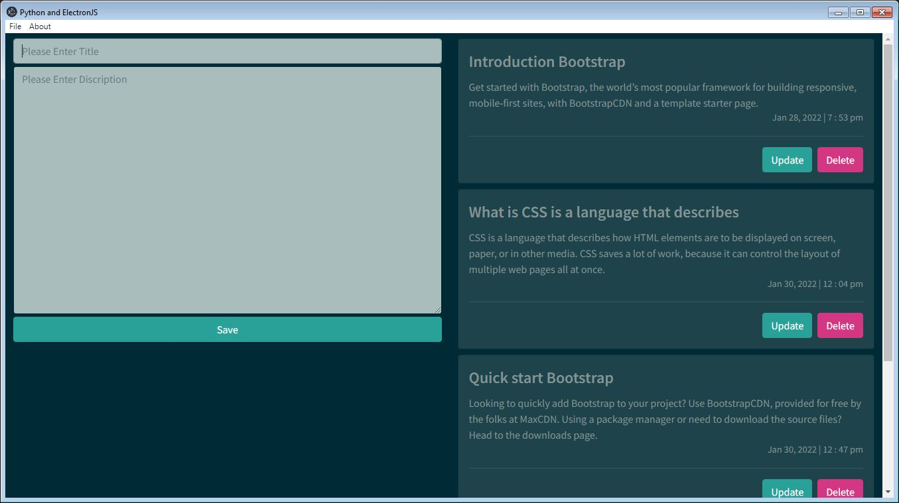

# This is a Article Posting Desktop Application using Python Flask Backend and ElectronJS Frontend

## Thank you to

This project base on [Python & ElectronJS Building Desktop GUI Application](https://www.youtube.com/watch?v=povYTkpJiRA) youtube video posted by [Parwiz Forogh](https://www.youtube.com/channel/UCD6ArU-AYbfIj5sx2L4SZAQ)

Thank you very much for your valuable tutorial!!! [Parwiz Forogh](https://www.youtube.com/channel/UCD6ArU-AYbfIj5sx2L4SZAQ)

-----------------------------------

## My Application User Interface



-------------------------------

## Introduction for Feather Developments

### using followings for this project
- Nodejs v13.14.0
- Python 3.7.3
- MySQL via XAMPP v3.2.4
- Bootstrap via bootswatch.com theme `solar`

### to install python packages
```
    pip install -r requirements.txt
```

### to install node packages
```
    npm i
```

### to run the application
- Open XAMPP
- Start Apache from XAMPP
- Strat MySQL from XAMPP
- Run `app.py` using package installed python venv
- Finally `npm start`

### http request testing
using the `REST Client` extention in vscode 